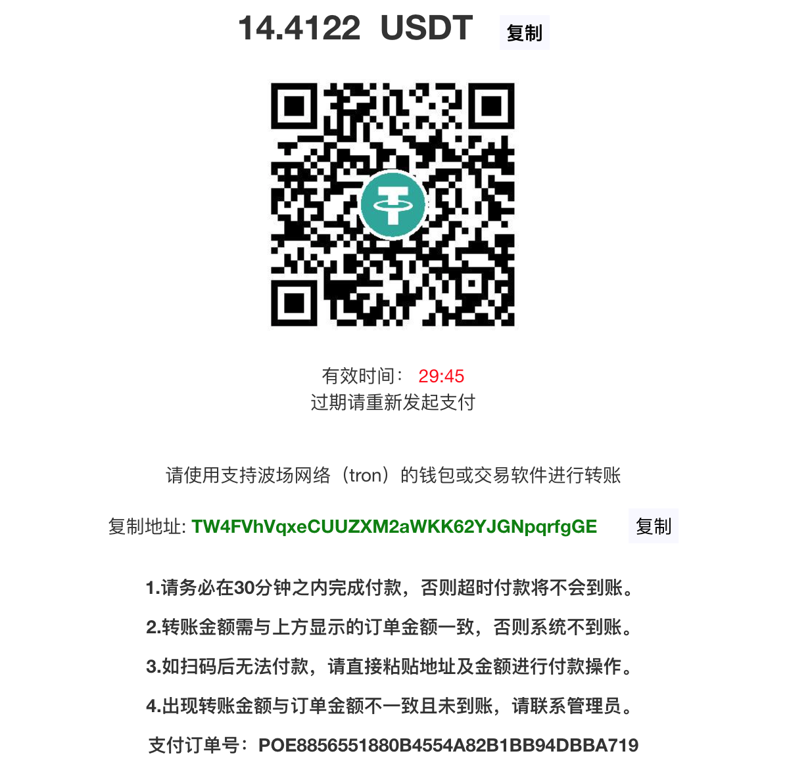

# 订单官方收银台

商户调用 `订单创建` 接口后，会返回如下格式数据：

```json
{
    "success": true,
    "code": 200,
    "msg": "SUCCESS",
    "data": {
        "orderNo": "POC712A9647CD2431F8FF3068C8AE1F907",
        "amount": 100,
        "tradeAmt": 14.4122,
        "currency": "cny",
        "symbol": "usdt",
        "usefulTime": 1665736446000,
        "address": "TW4FVhVqxeCUUZXM2aWKK62YJGNpqrfgGE",
        "qrcodeUrl": "https://dpaycoin.com/front/order/qrcode?	  orderNo=POC712A9647CD2431F8FF3068C8AE1F907",
        "cashierUrl": "https://dpaycoin.com/front/order/pay?orderNo=POC712A9647CD2431F8FF3068C8AE1F907",
        "signature": "874e8636425bb2f03b0c05ab0b280b9ea35ca25bb4942dcad650a51c0e953a80a3e49b317a51a9875b7af606acda5e607decdbaed3700673de3fed09b569854c0723fc279b4d227bd7241cc61f277b4a193846b9edbaeffd1f19244d30f6ef4e49be98b46df20cf396927073336987e34dd01a68baa837bf9a15239d160507e7"
    }
}
```

商户可直接从上述返回数据中，取出 `cashierUrl` 字段，然后跳转至该地址供用户支付。

## 收银台

跳转至 `cashierUrl` 后，页面显示如下：

> 电脑端




## 跳转

用户在收银台支付成功后，系统会自动通知商户在创建订单时指定的回调地址（`notifyUrl`）。在间隔大概 `1` 秒钟后，页面会自动跳转至商户在创建订单时指定的跳转地址（`returnUrl`）。

说明

若商户在创建订单时未指定 `notifyUrl`，则系统会使用商户在后台统一配置的 `订单回调地址`。

### 跳转地址

```bash
GET returnUrl（商户在订单创建接口中指定）
```

### 跳转参数

| 参数名  | 含义             | 类型       | 说明                                                         |
| :------ | :--------------- | :--------- | :----------------------------------------------------------- |
| orderNo | 商户自定义订单号 | string(32) | 商户可以通过 `orderNo` 参数，查询本地数据库，确认用户是否支付成功，并给出相应的页面展示。 |

注意

请不要将此跳转作为用户支付成功的判断条件，此行为极不安全。请根据支付成功的回调通知是否送达，来判断用户是否支付成功。