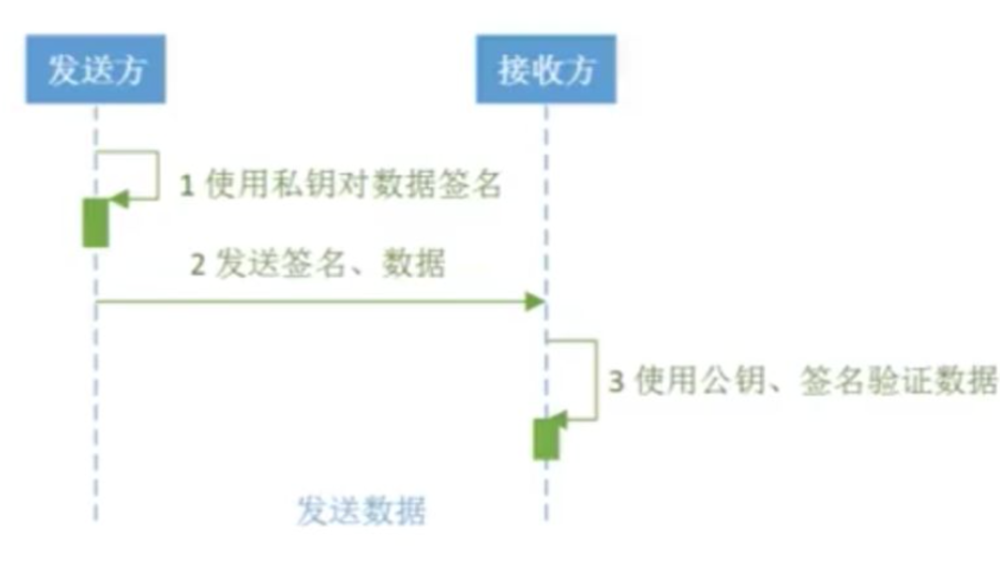

# 接口说明

## 编码

数据编码统一为 `utf-8`。

## 密钥

接口文档中提到的 `public key` & `private key`，都是指商户 `public key` & `private key`，可在商户后台 -> 设置 密钥信息栏查看。

公钥、私钥是通过RSA算法获取的一对Base64字符串，两者需配合使用。用`private key`  进行数据签名，通过`public key`进行数据验签。

## 字段选填

对于接口参数标记为 选填 的字段，可传入具体的值或者空字符串。

## signature

为保障接口安全，系统端会对接收到的所有数据，使用 `signature` 匹配校验，防止数据被非法篡改。

对于 `signature` 的生成算法为`md5WithRsa`。

举个例子：

如某个接口需要提交数据 `orderNo`、 `amount`两个字段，且 :

`privateKey` = `*********`（privateKey 由商户保管，且不可泄露给第三者）

`orderNo` = `PO82C7`，`amount` =  `100`。

根据 `signature` 的生成规则：

`toHex(sign(md5WithRsa,privateKey, orderNo+amount))`

则最终提交的 `signature` 数据为：

`toHex(sign('md5WithRsa',privateKey,'PO82C7100')) = 4263378beb1c22573a6a64f9e61f7545de11fbc1de11edb98431a73484defa52c0b71d45fbefa4c8502bf916e889441aacd7f9643b2fedb424d9fe4a1a4b7489772b558fef3b75f6f02e387e2bcffb17281044516185e676f4af93e425bfe608dbe5b17b168bd8db0d8ce2a43f09002da23f5c68f180e35c2b49918034aa2196`。

**注：toHex(data) 表示将签名后的数据转换为16进制字符串 。具体实现可以参考dPay demo.  &nbsp;&nbsp;&nbsp;&nbsp;   privateKey 由商户从平台获取后由自身保管，且不可泄露给他人！！**

