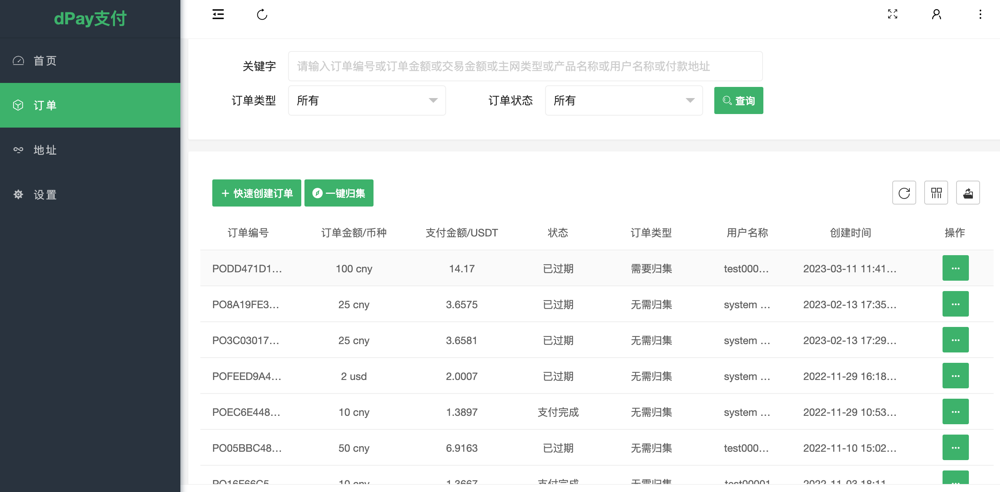

# 订单归集API接口开发中.......

# 当前可以前往dPay平台进行“一键归集”操作

操作如下：

1.登录[dPay](https://dpaycoin.com/login.html)商户后台.

2.点击`订单`菜单按钮，进入订单页面

3.点击 `一键归集` 进行订单归集操作

4.进入订单归集页面后面，需要设置 每笔订单归集所需要的GAS费，默认gas费为6 trx。不过建议单笔gas费用不要设置太少，以免影响归集速度。

5.归集完后的订单金额将全部转入商户的个人账户当中，后续商家可以前往  `个人账户` -> `提现申请` 进行提现操作。

**备注：**只有订单类型为“需要归集”，状态为支付完成的订单才能进入归集范围，如果满足前面两个条件后，但 订单金额 比矿工费还少时，则系统默认判断为无需归集该订单。

