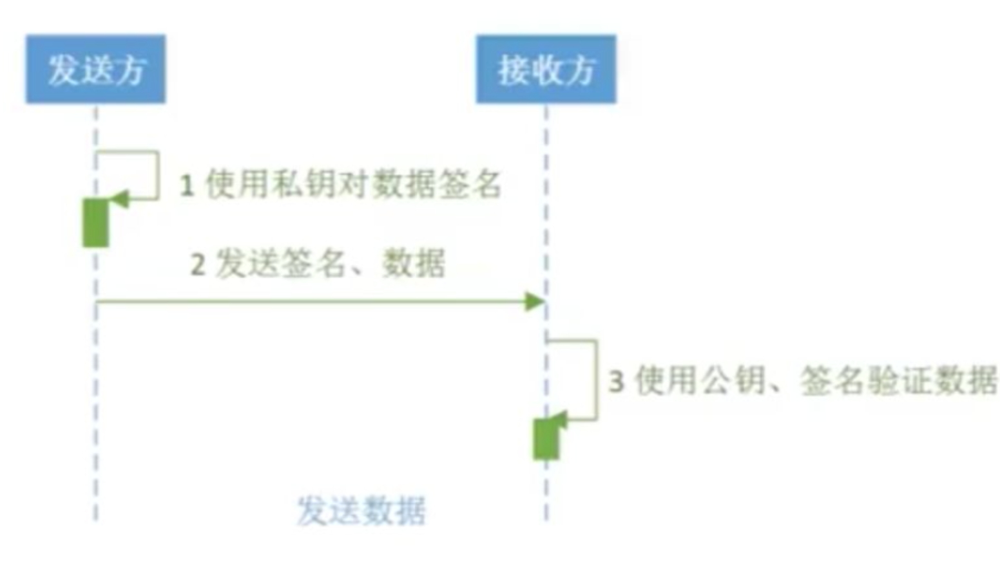

# 安全说明

## 密钥

商户的 `publicKey` 和 `privateKey` 非常重要，**请勿将其显示在任何网页代码、网址参数中**。

接口文档中提到的 `publicKey` & `privateKey`，分别是指平台公钥`publicKey`  & 商户私钥 `privateKey`， 分别可在商户后台:  设置 -> 平台公钥 和 设置 -> 商户密钥 栏查看。 商户方通过上面的方式可以拿到平台公钥和自己的密钥。

为了最大力度保证接口数据安全，我们采用了双密钥验证方案，即平台方拥有一对密钥、商户方拥有一对密钥，及时有一方密钥泄露，也会保证做了双向验证的接口数据安全。

商户公钥、私钥是通过RSA算法获取的一对Base64字符串，两者需配合使用，商户用自身的`privateKey`  对请求的数据进行数据签名，dPay官方平台会通过商户的`publicKey`对所请求数据进行数据验签检验。同理，平台方会对商户响应的数据通过平台私钥进行数据签名，商户通过获取的平台公钥对响应数据进行验签。

## signature

为保障接口安全，系统端会对接收到的所有数据，进行 `signature` 匹配校验，强烈建议商户端包含同样的校验逻辑，防止意外的安全风险。

## 钱包私钥

请务必妥善保管钱包的私钥（`privateKey`），否则可能导致意外的资金损失。

## 账户安全

建议商户开启基于 `Google authenticator` 的两步登录安全验证，防范因账密泄漏导致的资产安全问题。

## 接口安全

商户可在系统后台配置 `接口IP白名单`，防范因密钥泄漏导致的资产安全问题。

## HTTPS

部分接口需要提供 `notifyUrl` & `redirectUrl`，建议商户对服务器部署 `https` 服务，保障数据的通信安全。
