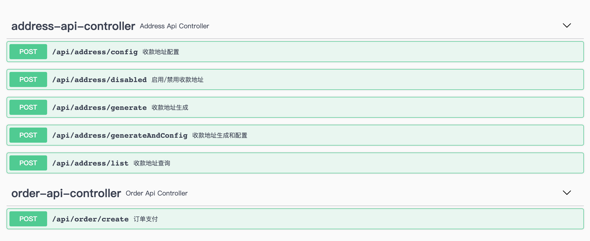

# 接入工具

目前 `dPay` 已提供 `java` 编程语言的接入示例及开发工具包。商户可参考相关项目，快速接入平台服务。

## Swagger  接入工具

https://dpaycoin.com/swagger-ui.html  swagger地址

## java 接入Demo

[https://github.com/usoppz/dPayDemo-java](https://github.com/usoppz/dPayDemo-java)

